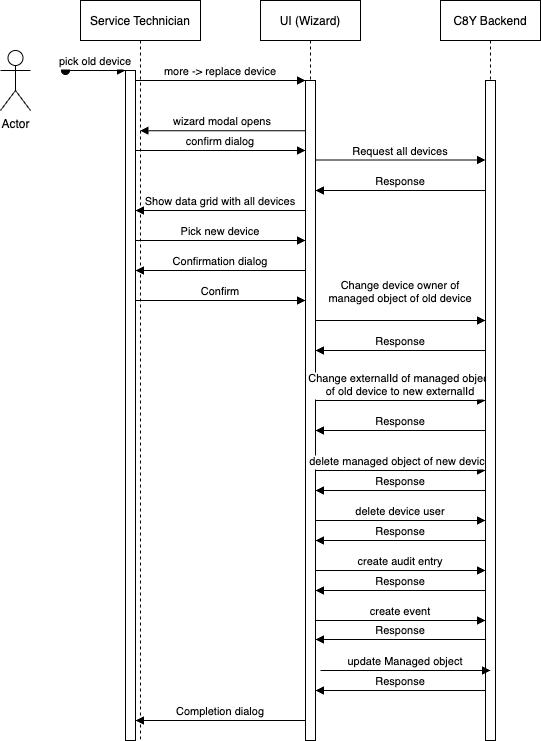

# Content

- [Content](#content)
- [Overview](#overview)
- [Requirements](#requirements)
- [Steps](#steps)
- [Limitations](#limitations)
- [Copyright Header](#copyright-header)

# Overview

The replacement wizard allows exchanging a physical device and keep the virtual representation on platform side with the full history. Therefore the user, which needs to be admin, is guides through several steps in order to  replace the device with a new one and keep the history of measurements, events, alarms etc. .
In the current implementation no child device support is given since some implementation do derive their external id of their parent device.

# Requirements

Devices with proper registration implementation need to be availabe within the platform. Additionally:

- Both devices (new and old) needs to be registered to platform and be able to send data
- Devices should be turned off during the replacement process
- Device implementation relays on c8y_Serial as identifier

# Steps

In order to replace a physical device and keep the history several steps and RestAPI calls are required.

<p align="center">

</p>
<br/>

1. User picks old device object in C8Y with e.g. owner: device_1234, externalID: 1234
   
   This can be done for example while adding the wizard to the more section within the device management, such that the old device object is picked via the device list.

   Screenshot of more -> replace device

2. User confirms the text dialog with all explanations about edge cases.
   

>Welcome to the Replacement Wizard!
>We will guide you through the process of the replacing a device without losing the history and the device information. Before starting the replacement process both devices, the old and the new one, must be turned on and connected to Cumulocity. The wizard will then ask you to select the new device to which you want the data to be transferred.
>Now you can turn off both devices again in order to avoid any inconsistencies during the process.
>Be aware: Devices with child assets are currently not supported. The replacement is not supported if the device owner is used for multiple devices.

3. User picks new device object in C8Y with e.g. owner:device_9876, externalID: 9876
   
Screenshot of data grid picker

>Click Next once you have chosen the device.
>Pop-up: Are you sure that you want to replace the data from the current device with the one selected?
>Pop-up: This device is currently not supported, because it has child assets.


4. ExternalID of new device object in C8Y of type c8y_Serial will be deleted
  
     The externalID of the new device will be removed since the later delete request is asynchron. Otherwise it can not be guaranted that the new physical device send data to the old managed object.

     ```shell
     DELETE /identity/externalIds/c8y_Serial/{device_name_new}
     ```

5. ExternalID of old device object in C8Y of type c8y_Serial will be deleted

     The externalID of the old device will be removed to prevent getting data from the old physical device.

     ```shell
     DELETE /identity/externalIds/c8y_Serial/{device_name_old}
     ```

6. ExternalID of old device object in C8Y of type c8y_Serial will be created with externalID of new physical device. ExternalID is now e.g. 9876.

     New physical device now points to the old managed object via the identifier c8y_Serial.

     ```shell
     POST /identity/globalIds/59720399/externalIds
     ```
     with

      ```json
    {
    "externalId": "9876",
     "type": "c8y_Serial"
    } 
     ```
     

7. Owner of old device object in C8Y will be changed to new device user. Owner is now device_9876.
   
     Device owner is the only user that is allowed to send data to a device. Thus the new device user needs to be owner of the managed object.

     ```shell
     PUT /inventory/managedObjects/{internalID_old_device}
     ```

     with 

     ```json
    {
    "id": "{internalID}",
    "owner": "device_9876"
    } 
     ```

8. New device object in C8Y will be deleted
   
     The new device is not needed anymore. However data that was send to the platform between connecting the new device and completly replacing the device will be lost and not migrated.

     ```shell
     DELETE /inventory/managedObjects/{internalID_new_device}
     ```

9. Old device user (devic_1234) will be deleted

     In order to prevent the old device to send data and the device will be re-created the device user of the old device is deleted. However a check is applied that the user is really just a device user and not a user.

     ```shell
     DELETE /user/{tenantid}/users/device_1234 
     ```
  
10. Completion dialog
    
>The replacement was successfully completed! Please turn the device on now.
>The replaced device was disconnected from the platform. If you want to use it again for another purpose, please register the device via the device management.
>Depending on your use case it might be necessary to factory reset your device. 

Additionally for documentation purposes the following will be done:

- Audit entry will be created
     ```json
     {"activity": "Device war replaced",
      "application": "devicemanagement",
      "source": {
        "id": "externalID_old",
      },
      "text": "Device {externalID_old} was replaced with {externalID_new}",
      "time": "2022-11-22T12:54:27.234Z",
      "type": "Inventory",
      "user": "murat.bayram@softwareag.com"
      }
     ```
- Event will be created
     ```json
     {
      "c8y_device_replacement": {},
      "source": {
        "id": "externalID_old"
      },
      "text": "Device {externalID_old} was replaced with {externalID_new}",
      "time": "2022-12-13T10:55:29.000Z",
      "type": "c8y_device_replacement"
    }
     ```
- Managed object will be updated with fragment about latest replacement
     ```json
     {
     "lastReplacement": {"time": "2022-12-13T10:55:29.000Z", "previousExternalID": "abc", "user": "murat.bayram@softwareag.com"}   
     }
     ```

# Limitations

- No child device support currently
- No support if one device owner has multiple devices


# Copyright Header

Each file that contains code from yourself should contain a copyright header in the following format:
````
Copyright (c) 2022 Software AG, Darmstadt, Germany and/or Software AG USA Inc., Reston, VA, USA,
and/or its subsidiaries and/or its affiliates and/or their licensors.

SPDX-License-Identifier: Apache-2.0

Licensed under the Apache License, Version 2.0 (the "License");
you may not use this file except in compliance with the License.
You may obtain a copy of the License at

     http://www.apache.org/licenses/LICENSE-2.0

Unless required by applicable law or agreed to in writing, software
distributed under the License is distributed on an "AS IS" BASIS,
WITHOUT WARRANTIES OR CONDITIONS OF ANY KIND, either express or implied.
See the License for the specific language governing permissions and
limitations under the License.

````


These tools are provided as-is and without warranty or support. They do not constitute part of the Software AG product suite. Users are free to use, fork and modify them, subject to the license agreement. While Software AG welcomes contributions, we cannot guarantee to include every contribution in the master project.

For more information you can Ask a Question in the [TECH Community Forums](https://tech.forums.softwareag.com/tag/Cumulocity-IoT).

Contact us at [TECHcommunity](mailto:Communities@softwareag.com?subject=Github/SoftwareAG) if you have any questions.


