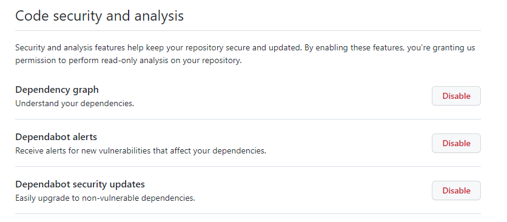

# Content

- [Overview](#overview)
- [Quickstart](#quickstart)

## Overview

The replacement wizard allows exchanging a physical device and replaces the virtual representation on platform side. Therefore the user, which needs to be admin, is guides through several steps in order to change replace the device with a new one and keep the history of measurements, events, alarms etc. .
In the current implementation no child device support is given since some implementation do derive their external id of their parent device.


## Requirements

- Both devices (new and old) needs to be registered to platform

## Steps

- User picks old device object in C8Y with e.g. owner: device_1234, externalID: 1234
- User picks new device object in C8Y with e.g. owner:device_9876, externalID: 9876
- Owner of old device object in C8Y will be changed to new deviceuser. Owner is now device_9876
- ExternalID of old device object in C8Y of type c8y_Serial will be changed to new externalID. ExternalID is now 9876
- New device object in C8Y will be deleted
- Old deviceuser (devic_1234) will be deleted (checking if really a device user before deleting)


### Limitations

- No child device support currently
- No support if one device owner has multiple devices

### License
We strongly suggest that you use the [Apache 2.0 License](https://www.apache.org/licenses/LICENSE-2.0).
If you use this repo as a template the license will be automatically applied to your repo.

If you don't use this template you should select the Apache License on repo creation:


If you use open-source 3rd Party Software please check the [license compatibility](https://joinup.ec.europa.eu/collection/eupl/solution/joinup-licensing-assistant/jla-compatibility-checker) 

### Copyright Header

Each file that contains code from yourself should contain a copyright header in the following format:
````
Copyright (c) 2022 Software AG, Darmstadt, Germany and/or Software AG USA Inc., Reston, VA, USA,
and/or its subsidiaries and/or its affiliates and/or their licensors.

SPDX-License-Identifier: Apache-2.0

Licensed under the Apache License, Version 2.0 (the "License");
you may not use this file except in compliance with the License.
You may obtain a copy of the License at

     http://www.apache.org/licenses/LICENSE-2.0

Unless required by applicable law or agreed to in writing, software
distributed under the License is distributed on an "AS IS" BASIS,
WITHOUT WARRANTIES OR CONDITIONS OF ANY KIND, either express or implied.
See the License for the specific language governing permissions and
limitations under the License.

````

---

These tools are provided as-is and without warranty or support. They do not constitute part of the Software AG product suite. Users are free to use, fork and modify them, subject to the license agreement. While Software AG welcomes contributions, we cannot guarantee to include every contribution in the master project.

For more information you can Ask a Question in the [TECH Community Forums](https://tech.forums.softwareag.com/tag/Cumulocity-IoT).

Contact us at [TECHcommunity](mailto:Communities@softwareag.com?subject=Github/SoftwareAG) if you have any questions.

---

##Github Settings

There are multiple settings you can make use of in your repository.
First of all we suggest to enable the Code Security and analysis functionality which includes a [Dependency graph](https://docs.github.com/en/code-security/supply-chain-security/understanding-your-software-supply-chain/about-the-dependency-graph), [Dependabot alerts](https://docs.github.com/en/code-security/dependabot/dependabot-alerts/about-dependabot-alerts) and [Dependabot security updates](https://docs.github.com/en/code-security/dependabot/dependabot-security-updates/about-dependabot-security-updates).



# Questions about this template

If you have any questions or suggestions regarding this template please create an [issue](https://github.com/SoftwareAG/cumulocity-iot-template/issues/new)

---
# PLEASE REPLACE THE PART ABOVE WITH YOUR OWN CONTENT !!!


